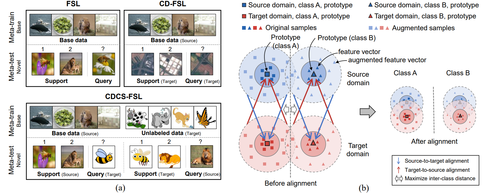

# Cross-Domain Cross-Set Few-Shot Learning via Learning Compact and Aligned Representations

This is the PyTorch implementation of stabPA.



## Prerequisites
We run this code with Ubuntu 16.04.5 LTS, Python 3.7 and Pytorch 1.4.0. qpth is also needed if you want to test MetaOptNet.


## Data preparation
### DomainNet
* Download real.zip, painting.zip, clipart.zip and sketch.zip from http://ai.bu.edu/M3SDA/
* unzip data to ```dataset/DomainNet```
* cd ```dataset/DomainNet``` and run ```split.py```

### Office-Home
* Download OfficeHomeDataset_10072016.zip from https://www.hemanthdv.org/officeHomeDataset.html
* unzip data to ```dataset/Office-Home```
* cd ```dataset/Office-Home``` and run ```split.py```


## Pretrain the classifier on the source data
```
python main.py --gpu 0 --dataset DomainNet --cross_domain painting --exp baseline
```
This will automatically test the 5-shot accuracy on the validation set.


## Train
```
python main.py --gpu 0 --dataset DomainNet --cross_domain painting --exp stabPA --st_align --ts_align --aug_type strong --init_teacher checkpoints/DomainNet/painting/ResNet18_baseline/baseline/50.tar
```


## Test
```
python main.py --gpu 0 --dataset DomainNet --cross_domain painting --split novel --test --n_shot 1 --exp test --st_align --ts_align --aug_type strong --resume --checkpoint checkpoints/DomainNet/painting/ResNet18_baseline/stabPA/
python main.py --gpu 0 --dataset DomainNet --cross_domain painting --split novel --test --n_shot 5 --exp test --st_align --ts_align --aug_type strong --resume --checkpoint checkpoints/DomainNet/painting/ResNet18_baseline/stabPA/
python main.py --gpu 0 --dataset DomainNet --cross_domain painting --split novel --test --n_shot 1 --reverse_sq --exp test --st_align --ts_align --aug_type strong --resume --checkpoint checkpoints/DomainNet/painting/ResNet18_baseline/stabPA/
python main.py --gpu 0 --dataset DomainNet --cross_domain painting --split novel --test --n_shot 5 --reverse_sq --exp test --st_align --ts_align --aug_type strong --resume --checkpoint checkpoints/DomainNet/painting/ResNet18_baseline/stabPA/
```


## Evaluate other methods
### ProtoNet
```
python main.py --gpu 0 --dataset DomainNet --cross_domain painting --exp protonet --method protonet
```
### RelationNet
```
python main.py --gpu 0 --dataset DomainNet --cross_domain painting --exp relationnet --method relationnet_softmax
```
### MetaOptNet
```
python main.py --gpu 0 --dataset DomainNet --cross_domain painting --exp metaoptnet --method metaoptnet
```
### DeepEMD
```
python main.py --gpu 0 --dataset DomainNet --cross_domain painting --exp deepemd --method deepemd --optimizer sgd --lr 5e-4 --init_model checkpoints/DomainNet/painting/ResNet18_baseline/baseline/50.tar
```


## References
This code is built on
* CloserLookFewShot: https://github.com/wyharveychen/CloserLookFewShot
* FixMatch-pytorch: https://github.com/kekmodel/FixMatch-pytorch
* rfs: https://github.com/WangYueFt/rfs
* MetaOptNet: https://github.com/kjunelee/MetaOptNet
* DeepEMD: https://github.com/icoz69/DeepEMD